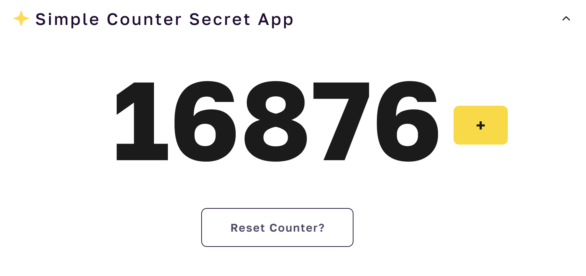
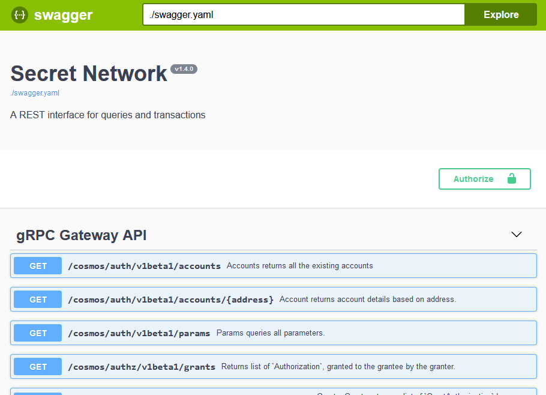

## Secret Counter Box

_(Brought to you by [Secret University](https://scrt.university))_

The Secret Counter Box is a quickstart for dapp development on [Secret Network](https://scrt.network). It consists of a frontend (Vue + Vite + Typescript) and a secret contract (Rust + Secret CosmWasm), based on the [secret counter template](https://github.com/secretuniversity/secret-template-cw1).

This is a beginner-level box and is for developers new to secret contract development. It illustrates the basics of instantiating a secret contract, and handling queries and transactions that modify state data.

The counter contract is made up of three "entry points," where messages (for queries and transactions) are handled.

The `instantiate` entry point is complete, but the methods called to hande the `Increment`, `Reset` and `GetCount`
messages are meant to be completed during the Secret Box [tutorial](app/tutorial/guide.md). For reference, the
fully-implemented contract and application code are under the `app/tutorial/solutions` directory.

| Entry point  | Message(s)     | JSON                               |
|--------------|----------------|------------------------------------|
| instantiate  | InstantiateMsg | `{ "count": 16876 }`               |
| execute      | Increment      | `increment {}`                     |
|              | Reset          | `reset { "count": 56 }`            |
| query        | GetCount       | `get_count {}`                     |

 

## Getting Started

To get started with this `Secret Box` you can either open it in Gitpod, or setup your local environment. The Gitpod workspace will save you time, as a lot of the heavy lifting, such as pulling the `LocalSecret` docker image, installing `Rust`, `cargo` and other tools, and deploying the secret contract are completed for you in a pre-build task. 

Gitpod also starts the `LocalSecret` blockchain and launches the frontend using _Vite_.

Once you're environment is ready to go, use this [guide](/app/tutorial/guide.md) to view the tutorial and complete the Secret Box code!

### Gitpod Workspace

Use the "Open in Gitpod" button below to launch the `Secret Counter Box`.

### Local Environment Setup

If you prefer to get started with this Secret Box locally, use the [Setting Up Your Environment](/docs/setting-up-your-environment.md) guide to install the required infrastructure. The guide will also walk you through launching the `LocalSecret` blockchain, building, testing and deploying the `secret counter` contract. And lastly, launching the frontend.

## Commands & Usage

The commands are broken into the following categories:

- working with the secret counter contract
- running the integration tests
- setting up and launching the `Simple Secret Counter DApp`

### Secret Contract

The following commands are run from the root of the project, from a terminal and apply to the secret contracts:

| Command                | Action                                                    |
|:---------------------  |:--------------------------------------------------------  |
| `make build`           | Compiles the secret contract                              |
| `make schema`          | Generates the JSON schema for messages and state files    |
| `make test`            | Runs the secret contract unit tests                       |
| `make localsecret`     | Launches the dockerized `localsecret` developer instance  |
| `make deploy`          | Stores the compiled/optimized contract on `localsecret`   |

### Integration Tests

The integration tests are located under the `tests` directory and use `secret.js` to create, deploy and 
interact with the secret counter contract. 

These are great examples of interacting with the Secret Network and can be used to bootstrap frontend development.

| Command                       | Action                                                    |
|:----------------------------  |:--------------------------------------------------------  |
| `npx ts-node secretbox.ts`    | Runs the integration tests                                |

### Frontend App

These commands apply to the frontend of the Secret Box and are run from the `app` directory:

| Command        | Action                                                   |
|:-------------- |:-------------------------------------------------------- |
| `yarn`         | Installs dependencies                                    |
| `yarn dev`     | Starts local Vite dev server at `http://localhost:5173`  |
| `yarn build`   | Build your production site to `./dist/`                  |
| `yarn preview` | Preview your build locally, before deploying             |

## LocalSecret LCD

`LocalSecret` implements an LCD (REST API), available on port 1317, that communicates with the Remote 
Procedure Call (RPC) endpoint and allows you to use HTTP to communicate with the node.

### Local Developer Environment

From within a local development environment, you can query and post transactions using: http://localhost:1317.

Checkout the http://localhost:1317/swagger/ UI which makes it easy to interact with the node. Or use 
http://localhost:1317/openapi/ to view the queries, transactions and parameters that are available.
 
### Gitpod Workspace

When using the Gitpod workspace, prepend the port number to the Gitpod URL. 

For example, if the workspace is at
`https://secretunive-secretcount-2qzt9b9me7a.ws-us77.gitpod.io`, then you can connect to the LCD service at
`https://1317-secretunive-secretcount-2qzt9b9me7a.ws-us77.gitpod.io`.

To use the Swagger or OpenAPI interaces append `/swagger/` or `/openapi/` to the Gitpod URL:

`https://1317-secretunive-secretcount-2qzt9b9me7a.ws-us77.gitpod.io/swagger/`

# Resources
- [Secret Network](https://docs.scrt.network) - official Secret Network documentation and guides
- [Secret IDE](https://www.digiline.io/) - an integration development environment specific to secret contracts
- [Gitpod](https://www.gitpod.io/docs) - Gitpod documentation
- [Vite](https://vitejs.dev/guide) - Guide on using Vite, a lean and fast development server
- [Vue](https://vuejs.org) - Progressive javascript framework

# Contributors
- Laura SecretChainGirl [Github](https://github.com/secetchaingirl) - secret contract development
- Alex Sinplea [Github](https://github.com/sinplea) - frontend development
- Jeff SecretMickey - [Telegram](https://t.me/secretMickey) Lead UI/UX design
- Kate Unakatu [Telegram](https://t.me/unakatu) - UI/UX design and graphics (Loreum Ipsem and Geek.pics founding team member)
