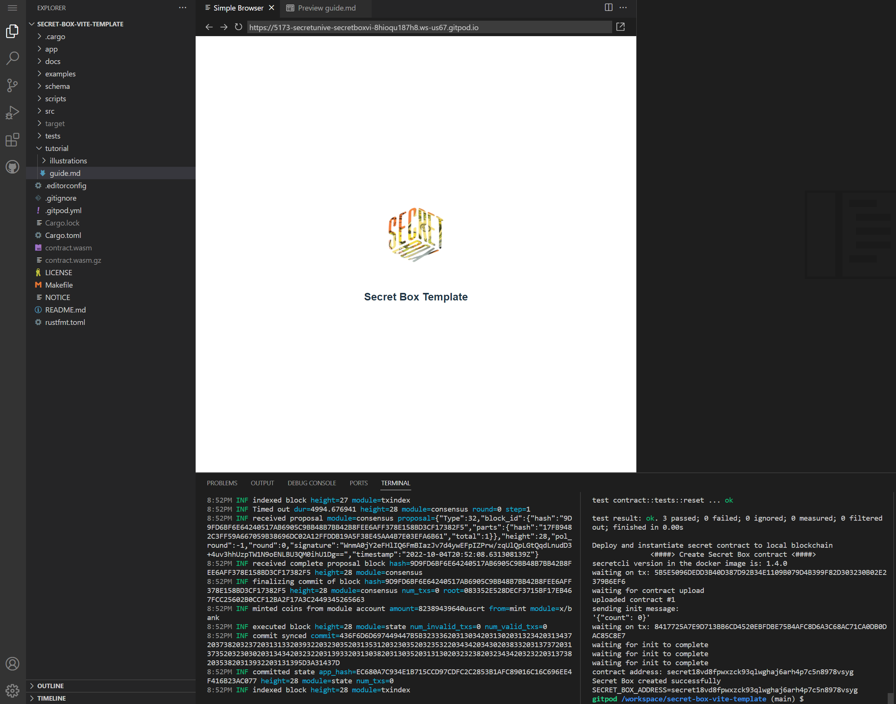

# Secret Box Template Tutorial 

This box comes with everything you need to create your own Secret Box. In the screenshot below, you can see the Secret Box launched in a [Gitpod](https://gitpod.io/docs) workspace. 

## Gitpod Workspace
The `.gitpod.yml` (in the project root directory) has definitions for tasks and prebuild information 
that define how the Secret Box is configured and launched.

During the prebuild phase, Gitpod installs all of the project dependencies including pulling the necessary docker
images used for `LocalSecret` and the contract optimizer (see the `Makefile`). And to make the startup process
faster, the secret contract is compiled and unit tests are run as part of the prebuild as well.

When the workspace is launched, `LocalSecret` is started, shown in the first terminal window (below). In the second terminal window, the script that uploads and instantiates the secret contract is kicked off. Finally, the frontend app is opened in a [VS Code](https://code.visualstudio.com/) browser preview window.

To open the Secret Box in an external browser, open a new terminal window within the 
workspace and enter the following Gitpod CLI command.
```
gp preview $(gp url 5173) --external
```

NOTE: the Vite server is configured to listen to port 5173 for requests.




## Getting Started

Aside from making your contract and app-specific changes to the template code, you'll want to update the following:

 1. `Cargo.toml` - `cargo` configuration and contract dependencies
<br/>

 2. `README.md` - information including how to run it locally (you can use the `docs/` directory for any diagram or other images needed to document your Secret Box). 
<br/>

 3. `examples/schema.rs` - update with the name of your secret contract
<br/>

 4. `tests/integration.ts` - integration tests for your Secret Box
<br/>

 5. `app/tutorial/` - write your guide in `guide.md` and include any images in `illustrations/`
<br/>

 6. `app/` - make your Secret Box frontend changes here
 <br/>

See the following steps for more details on the changes you'll want to make. Feel free to make any needed modifications to make this Secret Box your own :tada:.

## Cargo Configuration
 - Make sure to modify the `Cargo.toml` file so it has the correct Secret Box name, author, description, etc.
    
    ``` 
    [package]
    name = "secret-box-vite-template"
    version = "0.1.0"
    authors = ["laura <laura@secretchaingirl.io>"]
    edition = "2021"
    description = "A secret box template for the simple counter contract"
    license = "MIT" 
    ```
 - And define the secret contract dependencies needed by your Secret Box
    
    ``` 
    [dependencies]
    cosmwasm-std = { git = "https://github.com/scrtlabs/cosmwasm", branch = "secret" }
    cosmwasm-storage = { git = "https://github.com/scrtlabs/cosmwasm", branch = "secret"
    schemars = "0.8.1
    serde = { version = "1.0.114", default-features = false, features = ["derive"] }
    thiserror = { version = "1.0" }
    
    # [dev-dependencies]
    cosmwasm-schema = "1.0.0"
    ```

    
## README.md
 - Modify the "Open in Gitpod" link so that it references your Secret Box repository name/location

```
https://gitpod.io/#https://github.com/secretuniversity/secret-blueprint-box
```

*Once deployed to our platform, we will update the link so that it references the Secret University github organization*

 - Update it so that it's specific to your Secret Box.
 
The README is meant to be used in a local developer environment. Include instructions on setting up and running your Secret Box. Consider including anything you think will help [Secret University](https://scrt.university) list your secret box, upon review and approval by the core team. Based on your judgement, you might have images and even diagrams (e.g. UML), design descriptions--basically the key things you think will be helpful for Secret Network developers in learning from and using your Secret Box.

## Schema
- Modify `examples/schema.rs` and change the secret contract name so that it matches `Cargo.toml`

```
use secret_box_vite_template::msg::{CountResponse, ExecuteMsg, InstantiateMsg, QueryMsg};
use secret_box_vite_template::state::State;
```

## Integration Tests
- After completing your secret contract and unit test code, modify the `integration.ts` as needed. These are super helpful for illustrating how to interact with a Secret App such as connecting to the network, querying and executing transactions, etc.


## Tutorial
This is where you'll write the guide for your Secret Box. Under the `app/tutorial/` directory you'll find a starting guide (this file :tada:) in `guide.md`.

-  delete `app/tutorial/illustrations/secret-box-template.png`
<br/>
 
One thing to consider when writing your guide is to determine what blueprint code your Secret Box contains and 
what will be given in the tutorial for developers to add/modify manually.

In this scenario, consider creating a `solution/` or similar directory that developers can refer to while learning. 
It's also entirely possble, and acceptable, that your code is complete and the tutorial steps walk the developer 
through the key aspects and code snippets you decide to include!

This is an excellent example of a code walkthrough that is more inline with the above approach: [Millionaire's Problem Breakdown](https://docs.scrt.network/secret-network-documentation/development/getting-started/millionaires-problem-breakdown-extra-credit).

## Secret Box Frontend
This is where all of your frontend code goes, under the `app/` directory and is setup as a [Vite](https://vitejs.dev/guide/)  project using the [Vue](https://vuejs.org/) framework and [Typescript](https://www.typescriptlang.org/) programming language.

*Vite* is a fast, lean build tool that lets you work with a number of frameworks (e.g. *vue, react, svelte*) and either *Javascript* or *Typescript*.

If you want to use other frameworks and languages, feel free to completely revamp the frontend code, the `README.md` and `package.json` to fit your Secret Box needs.

After adding your code:

1. Use `src/assets/logo.png` in your `src/App.vue`, which is the Secret Box logo, somewhere within the header of your application
<br/>

2. Add any box images needed as part of your guide to the `illustrations/` directory. For example, listing unit-test results in a tutorial step
<br/>

3. Change the name of your Secret Box app in `package.json`
<br/>

4. Change the `<title>` element in `index.html` to the name of your Secret Box
<br/>

5. Put any images referenced in your modified `index.html` in the `public/` directory
<br/>

6. Modify the SecretBox Vue element in `App.vue`
<br/>

7. Images for your Secret Box frontend go in `src/assets`
<br/>

8. Create your frontend SecretBox component in `src/components/SecretBox.vue`
<br/>


### UI/UX
If you're able to create and implement your own Secret Box UI/UX that's great. Secret Boxes are meant to have beautiful, intuitive and easy to use interfaces.

If you're not that kind of developer (quite common!) and don't have the UI/UX expertise to create a polished user interface,  we ask that you include a wireframe in the form of a diagram or a simple text-based description of the elements required by your box and any other notes that would be helpful for our design/implementation team to bring your box to life. Our team will work with you to create a design based on your vision for your Secret Box.

We look forward to seeing what Secret Box you will create for the Secret Network developer community :tada:.


## Notes

For reference, the Gitpod deploy/instantiation of the Secret Box contract address is noted below:

```
secret18vd8fpwxzck93qlwghaj6arh4p7c5n8978vsyg
```

